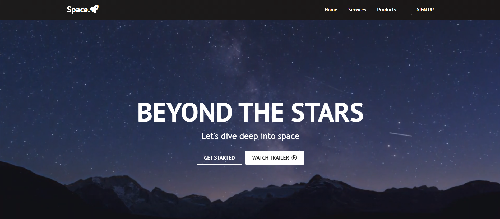
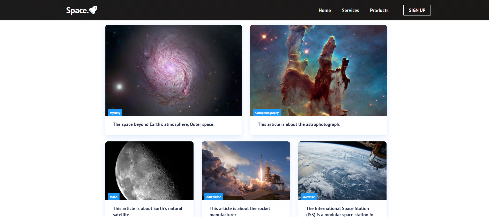
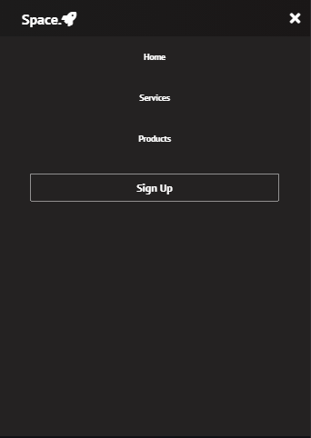

### Proje Nasıl Çalıştırılır

- Projeyi fork'ladıktan ya da indirdikten sonra projenin bulunduğu klasörde "npm install" komutu ile gerekli paketlerin yüklenmesi gerekiyor.
- Daha sonra "npm run start" komutu ile uygulama başlatılabilir.

### Proje Hakkında

- React kulanarak oluşturduğum bir website.
- https://vibrant-goodall-8b1bd1.netlify.app/

